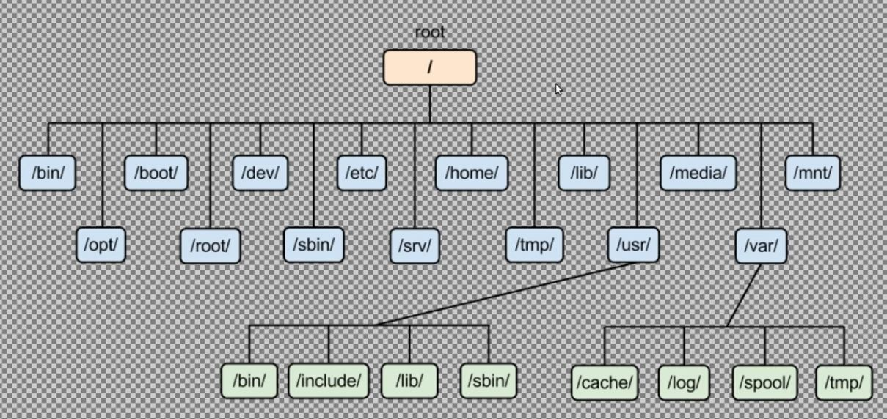

# First steps

Using the bash terminal is very fast and allows us to do a very wide range of actions.

## ls - Listing the documents

```bash
ls
```

`ls` gives us the list of what is contained inside the directory.

```bash
pwd
```

`pwd` gives us the full path of our location.
This gives us an absolute path.



To list everything in the `Documents` folder with a relative path, we'll do it like this.

```bash
ls Documents/
```

To do it with an absolute path, we write this.

```bash
ls /home/joe/Documents/
```

## ls options

The `-a` will show us everything.

```bash
ls -a
```

The `-l` will show us a long list.

```bash
ls -a
```

The `-la` will show us everything in a long list fashion.

```bash
ls -la
```

## cd - Change directory

This is how to get form one place to another.
You can use autofil by tapping the `Tab` key.
Double `Tab` will print you all the options.

```bash
cd Documents
```

### cd .. - Going one level up

```bash
cd ..
```

### cd ~ - Going home

```bash
cd
```

or

```bash
cd ~
```

Without any argument, the bash terminal understands that you want to go to your home directory.

### Dealing with directories and files with spaces

Dealing with that kind of names is very painful.
The `Tab` function helps you autocomplete with the space characters.

### pushd and popd - Jumping quickly between two directories

```bash
pushd /etc
```

This prints the dictory you jumped to and the former directory you were in.

```bash
popd
```

That brings you back to the former directory.

## file - Showing what kind of files

```bash
file .face
file .ssr
```

## locate - Finding a file

This will print all references to that file.

```bash
locate fstab
```

### Update the locate database

When you can't find a file, that could mean that the database isn't updated.
To do it, write the following command.

```bash
sudo updatedb
```

## which - Find commands path

`which` is a command that helps you find out if the command you are looking for is installed.

```bash
which cal
```

## history - Show already typed commands

The quickest way to show your command history is to type de `Up Arrow`.
You could also to `history`.
Usually show the 1000 last commands.

```bash
history
```
