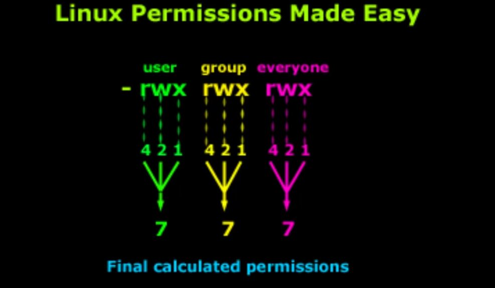

# Working with users

## sudo - Allow to do something as another user

`sudo` means substitute user do.

```bash
sudo updatedb
```

You can become the root user.
`sudo -s` activates the root user for some time.
To get out of this mode we type `exit`.

`su - cindy` switches you to another user called `cindy`.
If we do `pwd` we are now in their directory.

`su cindy` switches you to the other user but you stay in the same directory.

To run a command as root we do `su`.
`su -` sends you to the root's directory.

## users - Find out who's connected

`users` shows all logged in users.

## id - Gives information about the account

`id` helps you to figure out when something doesn't work.
Helps with permission issues.

## File permissions

```bash
cd Documents
ls -la
```

The file permissions show up on the first column.



### Read, write and execute

Permissions are stored in three groups.
There are 7 bits in a bit (in this instance).
`r` is read, `w` is write/delete, `x` is execute.

We can assign the permissions this way.
`r` is worth 4 bits, `w` 2 bits and `x` 1 bit.

#### chmod - Change mode command

The following command will give the execute permission to everyone on this file.
This is the `symbolic` way.

```bash
chmod +x file1
```

We could also use the bits numbers.
`chmod 700 file1` means that our user will be the only one who can interact with the file.

`chmod 744 file1` gives us all permissions and gives read permission to all the other ones.

When working with directories `755` is the way to give `r` permissions for everyone and `rwx` for you.
